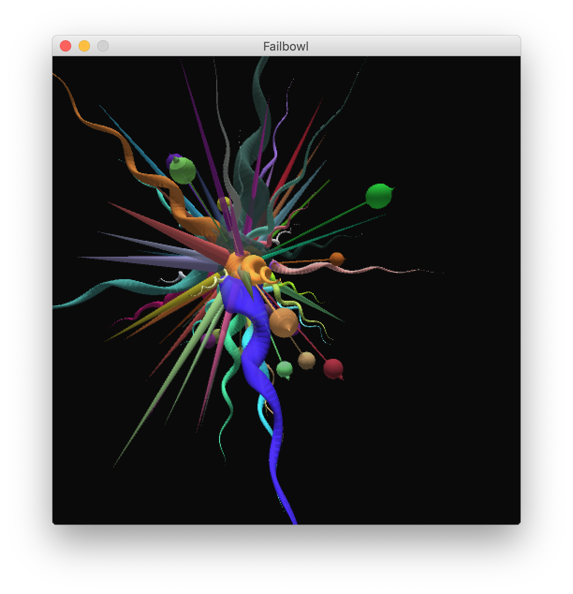
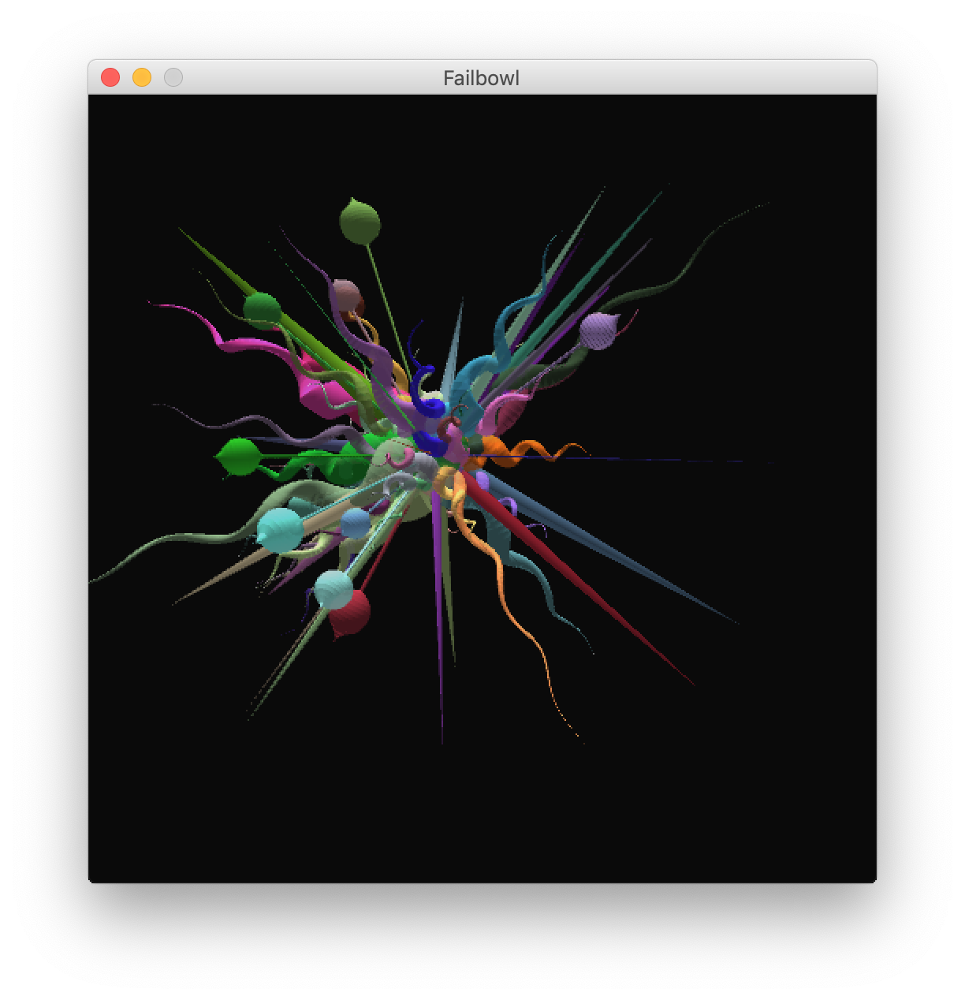

## glass-art
### Processing sketch that makes radial Chihuly-like structures

Examples:

When running the sketch controls are:
 - `<enter>`: clear screen and spawn anew
 - `<space>`: pause spawn sequence

---

N.B. At least in Mac OSX there is a bug in here that I haven't fixed related to window resizing...